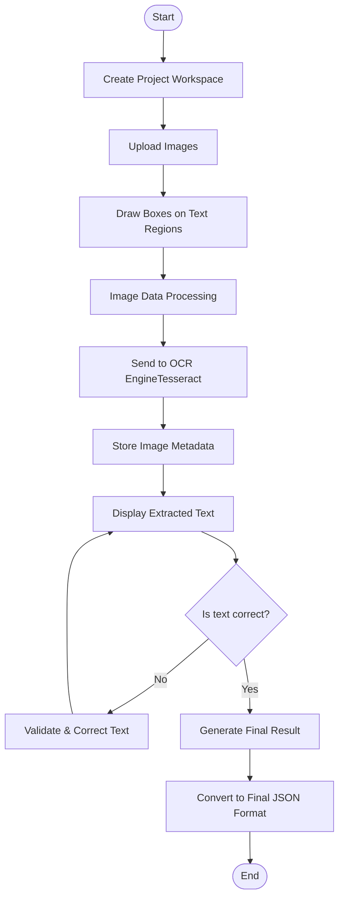

```mermaid
flowchart TD

    %% START
    A([Start]) --> B[Create Project Workspace]
    B --> C[Upload Images]
    C --> D[Draw Boxes on Text Regions]

    %% SYSTEM PROCESSING
    D --> E[Image Data Processing]
    E --> F[Send to OCR EngineTesseract]
    F --> G[Store Image Metadata]
    G --> H[Display Extracted Text]

    %% VALIDATION LOOP
    H --> I{Is text correct?}
    I -- No --> J[Validate & Correct Text]
    J --> H
    I -- Yes --> K[Generate Final Result]

    %% EXPORT
    K --> L[Convert to Final JSON Format]
    L --> M([End])
```
